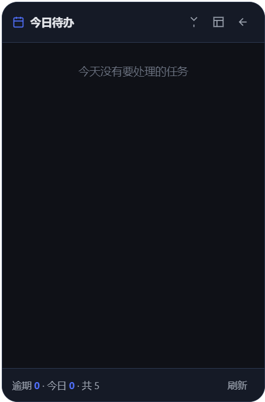

# 智能待办 · 桌面级待办事项应用

一款**免安装**的 Windows 桌面待办应用：**灵动岛悬浮窗**、**托盘后台常驻**、**按提醒风格自动安排提醒频率**。


## 快速开始

下载 `智能待办-便携版.exe`（本仓库 Releases，或按下方自行构建）后双击即可，无需安装：

- 屏幕右下角出现**灵动岛悬浮窗**，托盘出现应用图标
- 首次启动会带 5 条**示例任务**，主区顶部有一段说明，可一键清空；示例任务默认不提醒，不会打扰你
- 任务到期时以**应用内弹窗 + 灵动岛**提醒
- 关闭窗口的行为由「设置 → 退出操作」决定

自己构建（源码仓库不含 exe，构建产物已在 `.gitignore` 中排除）：

```bash
npm install
npm start          # 开发版
npm test           # 可选：提醒规则单元测试
npm run dist       # 打包：dist/智能待办-便携版-1.0.0.exe
```

## 功能特性

| 特性 | 说明 |
|------|------|
| 桌面级 | Windows 原生窗口与托盘，无边框自绘标题栏，图标全部为矢量图（无 emoji） |
| 退出操作可选 | 每次询问 / 后台常驻 / 彻底退出，选好即生效 |
| 灵动岛悬浮窗 | 默认开启；胶囊显示最要紧任务，点击展开卡片，可拖动到任意位置并记住位置，右键弹出常用操作菜单 |
| 稍后提醒 | 胶囊上的「稍后」、卡片提醒横幅、托盘菜单都能「10 分钟 / 1 小时 / 明天」推迟 |
| 全局快捷键 | `Ctrl+Alt+N` 从任何地方呼出「新建任务」 |
| 提醒风格 | 用大白话选择提醒频率：拖延者 / 忙碌者 / 组织者 / 完美主义者 |
| 任务视图 | 全部 / 今日到期 / 即将到期 / 已逾期 / 已完成，可按优先级、分类、关键词筛选 |
| DDL 管理 | 截止日期 + 时间，自动显示倒计时与逾期时长 |
| 分类管理 | 分类可新增 / 重命名 / 删除 |
| 外观 | 跟随系统 / 浅色 / 深色，7 种主题色，主窗口与灵动岛同步 |
| 开机自启 | 一键设置，副本与数据文件放在同一目录，不受临时目录清理影响 |
| 数据 | 本地保存、重启不丢，可一键导出备份 |

## 提醒风格

侧边栏顶部的「提醒风格」卡片点开进入**专属界面**，用生活化描述 + 时间线说明每种风格的提醒节点：

| 风格 | 适用心态 | 提醒次数 | 提醒时间点（相对截止） |
|------|---------|---------|----------------------|
| 拖延者 · 需要被催 | 我总拖着不动，请多提醒我几次 | 10 次 | 7 天前 / 3 天前 / 2 天前 / 1 天前 / 12 小时前 / 6 小时前 / 3 小时前 / 2 小时前 / 1 小时前 / 30 分钟前 |
| 忙碌者 · 别烦我 | 我很忙，只在关键节点提醒我 | 2 次 | 1 天前 / 2 小时前 |
| 组织者 · 心里有数 | 我自己会安排，提醒一次就够 | 1 次 | 6 小时前 |
| 完美主义者 · 不能出错 | 我要提前很久就收到分阶段提醒 | 5 次 | 7 天前 / 3 天前 / 1 天前 / 6 小时前 / 1 小时前 |

> **拖延者刻意催得最密**：10 个提醒点从提前 7 天一路铺到提前 30 分钟，越接近截止越密；
> 同一时间点只提醒一次，不会因为点多而重复弹窗。

进入方式：侧边栏「提醒风格」卡片，或 设置 → 提醒风格 → 更改风格。

## 任务视图范围

五个视图互不重叠（都只看未完成任务）；鼠标悬停在视图名上也会显示范围：

| 视图 | 范围 |
|------|------|
| 全部任务 | 所有任务 |
| 今日到期 | 今天 00:00 ~ 今天 24:00 到期 |
| 即将到期 | 明天 00:00 起，至今天起第 7 天 00:00 之前（**不含今天**） |
| 已逾期 | 截止时间在今天 00:00 之前 |
| 已完成 | 已勾选完成 |

## 退出操作

设置 → **退出操作**，直接选择、选好即生效、重启后保持：

| 选项 | 点关闭按钮时 |
|------|------------|
| 每次询问 | 弹出「后台常驻 / 彻底退出 / 取消」选择框 |
| 后台常驻 | 窗口隐藏，程序在系统托盘中继续运行并按时提醒 |
| 彻底退出 | 结束程序进程，不再接收提醒 |

设置面板会跟踪「提醒提前量 / 声音提示」的未保存改动（标题旁有标记），未保存就关闭会询问「保存 / 放弃更改 / 取消」；退出操作、外观、主题色、提醒风格、分类都是即时生效的。

## 灵动岛悬浮窗

默认开启，首次出现在屏幕右下角；可用操作栏的「悬浮窗」按钮或托盘菜单开关，开关状态会被记住。

<table>
<tr>
<td><br><sub>折叠态：胶囊只显示最要紧的一条</sub></td>
<td><br><sub>点击展开：逾期与今日任务列表</sub></td>
</tr>
</table>

### 胶囊状态

折叠态为药丸胶囊，图标与配色随状态变化，一行显示最要紧的信息：

| 状态 | 触发条件 | 胶囊显示 | 图标 / 配色 |
|------|---------|---------|------------|
| 逾期 | 有已过截止时间的未完成任务（**含今天已过点的**） | 「逾期 N 项」+ 最急任务名 · 超时 2 小时 | 感叹号 / 红 |
| 即将到期 | 最近一条在 2 小时内到期 | 「即将到期」+ 任务名 · 还有 30 分钟 | 时钟 / 琥珀 |
| 今日到期 | 今天还有未到期任务 | 「今日 N 项」+ 任务名 · 23:30 | 清单 / 主题色 |
| 今日无到期 | 今天没有，但有更晚的任务 | 「今日无到期」+ 明天 9:00 · 任务名 | 清单 / 灰 |
| 全部完成 | 有任务且都已完成 | 「已全部完成」+ 共 N 项 | 对勾 / 绿 |
| 无任务 | 一条任务都没有 | 「暂无任务」 | 清单 / 灰 |
| 提醒中 | 收到提醒后的 5 秒内 | 提醒标题 + 有任务提醒 | 铃铛 + 扫描动画（覆盖以上任意状态） |

「超时 / 还有」的时长按分钟、小时、天自动换算；任务名过长会截断。展开后的列表逾期在前、今天剩余在后，每条标注「超时 2 小时」这类精确时长。

> **关于逾期口径**：胶囊与展开列表按**精确时刻**判定（今天 10:00 已过点即算逾期），
> 侧边栏「已逾期」视图按**天**判定（今天 00:00 之前），所以胶囊的逾期项数可能多于侧边栏。

### 交互

- **点击药丸**展开为卡片，可用钉子图标切换置顶、箭头收起。
- **右键胶囊（或卡片）**弹出菜单：打开主界面、新建任务、设置、稍后提醒、取消稍后提醒、窗口置顶、隐藏悬浮窗——不用先打开主窗口就能操作。
- **拖动**：按住药丸（或卡片标题区）拖到任意位置，位置会被记住；拖动范围限制在屏幕内，小幅抖动仍按点击处理，不会误拖。
- **自动收回**：展开后 6 秒内没有实际操作就切回胶囊。
- **点击穿透**：岛体之外的空白区不遮挡桌面点击，指针移入岛体即恢复可交互。
- **提醒联动**：收到提醒时保持当前形态不变——
  - 胶囊：蓝色圆内播放扫描光带 + 旋转弧环，图标切换为铃铛，文字上滑淡入；
    右侧同时出现「稍后」按钮（保留 60 秒），可直接点选推迟时间；
  - 卡片：显示渐变横幅（带「稍后提醒」按钮），20 秒后移除；30 分钟内展开卡片仍能看到这条提醒。
  - 只有真正的任务提醒才带「稍后」；任务完成之类的提示不会出现该按钮。

## 其他功能

- **提醒方式**：任务到期时弹出应用内提示并在灵动岛显示横幅（**不弹 Windows 系统通知**）；声音提示可在设置中开关。
- **稍后提醒**：提醒到来时，胶囊上会出现「稍后」按钮（点开可选 10 分钟 / 1 小时 / 明天 9:00），展开卡片后横幅里也有同样的三个按钮，托盘右键菜单同样可用。
  - 推迟后**任务行上会出现「稍后 X 分钟」标记**，点它即可取消；托盘菜单里也有「取消稍后提醒（N 项）」。
  - **不会让人错过 DDL**：如果推迟时间超过了距截止的剩余时间，提醒会自动提前到**截止前 1 分钟**，此时通知标题为「稍后提醒」并说明只剩 1 分钟；若已经逾期则直接提示「任务已逾期」。
- **全局快捷键**：`Ctrl+Alt+N` 从任何地方呼出主窗口并打开「新建任务」表单（托盘菜单同一入口）。
- **提醒可靠性**：应用会在后台按时检查提醒（不受窗口隐藏影响）；关闭或休眠期间错过的提醒，会在下次启动/唤醒时补发（最多回溯 12 小时），同一条提醒不会重复弹出。
- **新建任务**：表单默认隐藏，点顶部「新建任务」后以悬浮卡片出现在窗口顶部；点遮罩、右上角关闭或按 `Esc` 收起。
- **外观与主题色**：设置里可选跟随系统 / 浅色 / 深色（跟随系统时随 Windows 实时切换），以及 7 种主题色。
- **分类管理**：侧边栏「管理」按钮或设置里均可增删改；删除分类时其下任务自动归入「其他」。
- **首次启动说明**：新用户会看到 5 条带「示例」标记的示例任务和一段可关闭的提示卡片，卡片里说明示例任务不提醒、顶部各图标的作用、以及提醒到来时怎么用「稍后」；点「清空示例任务」可一键删掉这 5 条（你自己建的任务不受影响），点「知道了」后不再出现。
- **开机自启**：开启时把程序自身复制一份到**数据目录**（`%APPDATA%\smart-todo-desktop\智能待办.exe`，和 `todo-data.json` 放在一起），并让自启项指向这份副本；关闭时自动删除该副本，不留残留。程序更新后副本会跟着更新，副本被误删也会在下次启动时自动补回；旧版本遗留在 `%APPDATA%\SmartTodoDesktop\` 的副本会在启动时自动清理。
- **系统托盘**：单击 / 双击图标打开主窗口；右键菜单可新建任务、显示全部任务、开关悬浮窗、开关开机自启、退出。
- **数据位置**：`%APPDATA%\smart-todo-desktop\todo-data.json`（任务与设置）、`window.json`（窗口位置）；开启自启后，同目录下还会有一份 `智能待办.exe`（自启用的副本）。设置里有「打开数据目录」与「导出备份」。

## 打包常见问题

- 下载 Electron / 打包组件失败：仓库内 `.npmrc` 已配置国内镜像。
- 代码签名组件下载超时：设 `CSC_IDENTITY_AUTO_DISCOVERY=false`。
- 仓库位于 OneDrive 等同步目录时解压可能被占用而失败，把输出目录指到同步目录之外：
  `npm run dist -- --config.directories.output=D:\todo-dist`
- 偶发 `Access is denied`（安全软件拦截新写文件）：重试一次即可。
